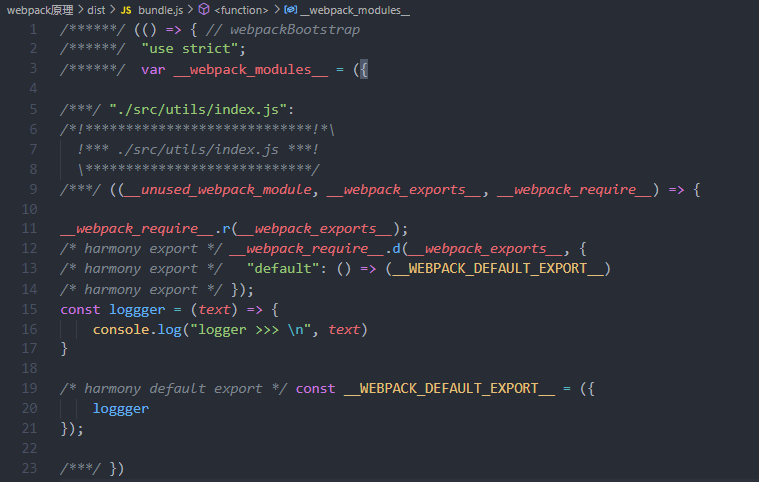

# webpack runtime

> webpack版本: 5.65.0

## 代码解析


首先项目代码如上所示, 只有一个app.js入口文件, 代码使用控制台打印了一段文本, 然后build后输出了dist文件夹, 里面有一个bundle.js以及对应的sourcemap文件, 下面先忽略.map文件, 看下bundle.js文件代码

**bundle.js代码如下所示**


上面的代码只有一个`自执行函数(IIFE)`和最底部的sourcemap对应链接, 然后看下IIFE里面的代码, 可以看到入口文件对应的代码, 以及一个未使用到的`__webpack_exports__`对象, 这就是一个最简单的webpack输出的代码了

接下来添加一个`utils`模块文件, 在`app.js`中引入`utils/index.js`, 看下有了依赖模块后的bundle.js代码有什么变化


**输出的bundle.js代码如下**


可以看到代码行数多了很多, 然后app.js的代码在`83行到94`行之间, 其中跟源码的不用之处在于多了`87`行`__webpack_require__.r(__webpack_exports__);`, 并且模块导入语句也由`import ... from "..."`变为一个`__webpack_require__`函数, 这其中最关键的的输出, 就在于`__webpack_require__`这个函数了, 那么我们看下, `__webpack_require__`函数是如何定义的


**__webpack_require__函数代码如下**

```js
/******/ 	});
/************************************************************************/
/******/ 	// The module cache
/******/ 	var __webpack_module_cache__ = {};
/******/ 	
/******/ 	// The require function
/******/ 	function __webpack_require__(moduleId) {
/******/ 		// Check if module is in cache
/******/ 		var cachedModule = __webpack_module_cache__[moduleId];
/******/ 		if (cachedModule !== undefined) {
/******/ 			return cachedModule.exports;
/******/ 		}
/******/ 		// Create a new module (and put it into the cache)
/******/ 		var module = __webpack_module_cache__[moduleId] = {
/******/ 			// no module.id needed
/******/ 			// no module.loaded needed
/******/ 			exports: {}
/******/ 		};
/******/ 	
/******/ 		// Execute the module function
/******/ 		__webpack_modules__[moduleId](module, module.exports, __webpack_require__);
/******/ 	
/******/ 		// Return the exports of the module
/******/ 		return module.exports;
/******/ 	}
```

从代码和注释可以看到, `__webpack_require__`函数接收一个入参moduleId, 然后主要做了两件事

1. 创建一个新的模块对象`module`, 并且把这个`module`根据moduleId绑定到缓存对象`__webpack_module_cache__`中, 下次再调用`__webpack_require__`时, 可以直接从缓存中返回这个模块对象

2. 根据`moduleId`在`__webpack_modules__`对象中获取到对应的执行函数, 然后将`module, module.exports, __webpack_require__`作为参数, 执行函数, 然后返回`module.exports`

在`__webpack_require__`代码里又用到了一个新的对象`__webpack_modules__`, 这个对象其实就是我们代码中的依赖声明了, 其中键为模块路径, 值为模块的执行函数, 这个对象是由`webpack`自动生成的

**__webpack_modules__对象声明如下**



可以看到, `app.js`依赖的`utils`模块代码,就在`__webpack_modules__`对象里面

## `webpack_require`

`__webpack_require__`函数除了缓存、获取模块对象之外， 还提供了一些静态方法

```js
/************************************************************************/
/******/ 	/* webpack/runtime/define property getters */
/******/ 	(() => {
/******/ 		// define getter functions for harmony exports
/******/ 		__webpack_require__.d = (exports, definition) => {
/******/ 			for(var key in definition) {
/******/ 				if(__webpack_require__.o(definition, key) && !__webpack_require__.o(exports, key)) {
/******/ 					Object.defineProperty(exports, key, { enumerable: true, get: definition[key] });
/******/ 				}
/******/ 			}
/******/ 		};
/******/ 	})();
/******/ 	
/******/ 	/* webpack/runtime/hasOwnProperty shorthand */
/******/ 	(() => {
/******/ 		__webpack_require__.o = (obj, prop) => (Object.prototype.hasOwnProperty.call(obj, prop))
/******/ 	})();
/******/ 	
/******/ 	/* webpack/runtime/make namespace object */
/******/ 	(() => {
/******/ 		// define __esModule on exports
/******/ 		__webpack_require__.r = (exports) => {
/******/ 			if(typeof Symbol !== 'undefined' && Symbol.toStringTag) {
/******/ 				Object.defineProperty(exports, Symbol.toStringTag, { value: 'Module' });
/******/ 			}
/******/ 			Object.defineProperty(exports, '__esModule', { value: true });
/******/ 		};
/******/ 	})();
/******/ 	
/************************************************************************/
```

**处理完注释和自执行函数, 代码如下所示**

```js
__webpack_require__.d = (exports, definition) => {
    for (var key in definition) {
        if (__webpack_require__.o(definition, key) && !__webpack_require__.o(exports, key)) {
            Object.defineProperty(exports, key, { enumerable: true, get: definition[ key ] })
        }
    }
}


__webpack_require__.o = (obj, prop) => (Object.prototype.hasOwnProperty.call(obj, prop))


__webpack_require__.r = (exports) => {
    if (typeof Symbol !== 'undefined' && Symbol.toStringTag) {
        Object.defineProperty(exports, Symbol.toStringTag, { value: 'Module' })
    }
    Object.defineProperty(exports, '__esModule', { value: true })
}
```

各个方法的用途

1. `__webpack_require__.d` 遍历一个对象的属性, 赋值给另外一个对象 , 用于模块内部导出变量的定义, 如果模块内部没有导出变量, 则不需要使用这个方法


2. `__webpack_require__.o` 检查对象自身是否有指定的属性

3. `__webpack_require__.r` 给exports对象设置<a href="https://developer.mozilla.org/zh-CN/docs/Web/JavaScript/Reference/Global_Objects/Symbol/toStringTag">Symbol.toStringTag</a>属性为`Module`并且设置`__esModule`属性为true, 目的是为了指定导出的模块类型, 这里的相关知识后面再讲

## 总结
在本篇文章中, 分析了webpack打包后的代码结构, 其中最主要的是`__webpack_require__`函数, 这个函数用于个根据moduleId获取模块对象, 并且所有依赖执行函数集保存在全局的`__webpack_modules__`对象当中, 在执行模块代码时, 会调用`__webpack_require__`函数定于的静态方法, 在模块内部导出并且标记导出模块类型。这些就是webpack输出代码中的依赖导入部分了，但是本篇文章只是对简单的js代码依赖部分进行分析， 还有其他部分没涉及到，比如`懒加载`， `按需加载`，`模块类型解析(cmj和esm如何区分)`，`非js模块依赖引用`等等事如何处理的, 希望在后续的文章中能够深入了解。 


## 参考

<div id="refer-anchor-1"></div>

- [1] [webpack官方文档](https://webpack.docschina.org/)

<div id="refer-anchor-2"></div>

- [2] [[MDN] Symbol.toStringTag](https://developer.mozilla.org/zh-CN/docs/Web/JavaScript/Reference/Global_Objects/Symbol/toStringTag)
   
   