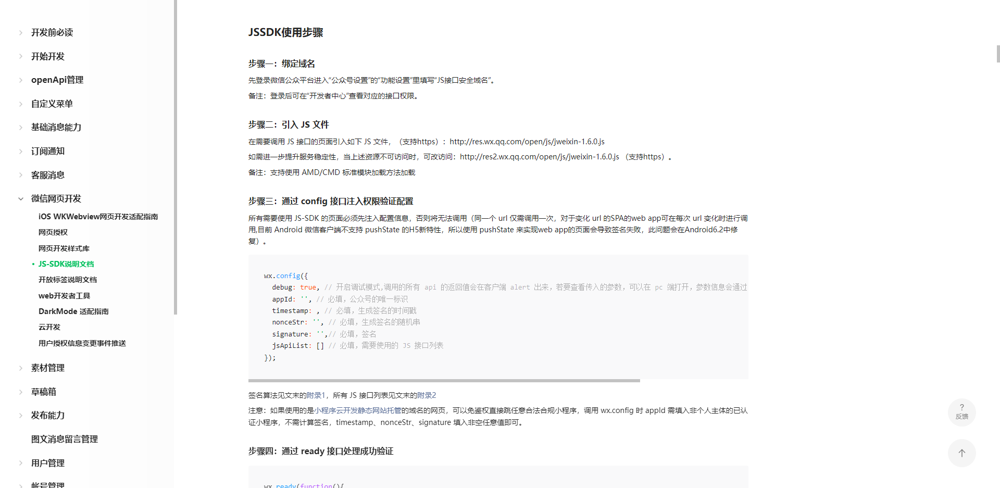

# 通过微信JS-SDK了解JSBridge

## 前言
最新在复习JSBridge原理，然后我们平常用的最多的是`微信JS-SDK`，因此希望通过分析微信的JS-SDK代码，了解微信是如何通过JSBridge和微信客户端进行通讯的。

## 开始
首先通过[微信JSSDK官方文档](https://developers.weixin.qq.com/doc/offiaccount/OA_Web_Apps/JS-SDK.html#2)查看使用方法



我们忽略步骤一, 通过步骤二的官方链接直接下载 [jweixin-1.6.0](http://res.wx.qq.com/open/js/jweixin-1.6.0.js) 代码。下载完成后, 会得到混淆过的JS代码, 然后通过vscode等编辑器或工具格式化JS代码。

## JSSDK代码简析

```js
// http://res.wx.qq.com/open/js/jweixin-1.6.0.js

!(function (e, n) {
// ...主要函数代码
})(this, function (o, e) {
// ...回调函数代码
});
```

JSSDK代码经过简化后，发现只有一个`自执行函数(IIFE)`，接下来拆开这个IIFE，分别看下具体的函数实现和函数调用。

```js
// 主要函数声明
function main(e, n) {
  "function" == typeof define && (define.amd || define.cmd)
    ? define(function () {
        return n(e);
      })
    : n(e, !0);
};

// 主要函数调用
main(this, function callback (o, e) {/* ... */})
```

这个函数主要做了两件事, 接收全局执行上下文的 `this` (正常情况下指向window) 和一个回调函数`n`, 并将`this`传给回调函数`n`。 如果存在 `define` 方法, 返回回调函数的返回值

> 对defined方法的判断是为了支持使用 AMD/CMD 标准模块加载方法

## 回调函数代码分析

回调函数经过简化后, 主要有以下关键代码。在这里先注释它们的作用。

```js
function callback(o, e) {
    // 初始化逻辑
    if (!o.jWeixin) {/* ... */}

    //【mutation】 通过WeixinJSBridge主动跟nactive通讯 
    function M(n, e, i) {/* ... */}

    //【publish】 监听用户交互事件, 触发trigger事件, 并执行WeixinJSBridge.invoke方法主动跟nactive通讯
    function P(n, i, t) {/* ... */}

    // 标准化传递给WeixinJSBridge.invoke的参数
    function x(e) {/* ... */}

    //【verify】对部分敏感api添加安全校验参数
    function V(e) {/* ... */}

    //【all】 对WeixinJSBridge.invoke方法进行统一回调函数处理
    function A(e, n, i) {/* ... */}

    //【convert】 将wx对象上的方法, 映射成WeixinJSBridge.invoke与Nactive实际的通讯的方法名称
    function C(e) {/* ... */}

    //【breakpoint】 日志打印
    function B(e, n) {/* ... */}

    //【log time】 记录初始化完成时间
    function L() {/* ... */}

    //【once || onReady】 异步代码，在WeixinJSBridge注入完成后执行回调
    function O(e) {/* ... */}
}
```

> 上述注释的函数名称是本人根据函数的作用进行重新命名, 所以对函数名不必太过在意

callback 关键函数和变量介绍

 - 全局 `window.WeixinJSBridge`: 微信Nactive端暴露给全局的JSBridge
 - `window.jWeixin` 和 `window.wx`: 初始化完成后, 挂载到全局的方法调用对象
 - 函数 M : 通过`WeixinJSBridge.invoke`方法与Nactive端进行通讯
 - 函数 P : 通过`WeixinJSBridge.on`方法监听Nactive端事件, 并通过函数M与Nactive通讯
 - 函数 O : 在WeixinJSBridge注入到全局对象后触发
 - 函数 C : 将wx对象上的方法, 映射成WeixinJSBridge.invoke与Nactive实际的通讯的方法名称


## 初始化代码分析

通过上面的代码, 我们知道, 当我们引入微信js-sdk时, 会执行一个IIFE, 执行回调函数, 并且如果是cmd和amd模块的话, 导出回调函数返回值。接下来通过分析回调函数初始化部分的相关代码, 看下初始化的时候做了哪些事。

去除了一些其他处理逻辑, 主线代码如下所示

```js
if (!o.jWeixin) {
  var c = {
    config: "preVerifyJSAPI",
    onMenuShareTimeline: "menu:share:timeline",
    onMenuShareAppMessage: "menu:share:appmessage",
    onMenuShareQQ: "menu:share:qq",
    onMenuShareWeibo: "menu:share:weiboApp",
    onMenuShareQZone: "menu:share:QZone",
    previewImage: "imagePreview",
    getLocation: "geoLocation",
    openProductSpecificView: "openProductViewWithPid",
    addCard: "batchAddCard",
    openCard: "batchViewCard",
    chooseWXPay: "getBrandWCPayRequest",
    openEnterpriseRedPacket: "getRecevieBizHongBaoRequest",
    startSearchBeacons: "startMonitoringBeacons",
    stopSearchBeacons: "stopMonitoringBeacons",
    onSearchBeacons: "onBeaconsInRange",
    consumeAndShareCard: "consumedShareCard",
    openAddress: "editAddress",
  };

  var w = {
    config: function (e) {},
    ready: function (e) {},
    error: function (e) {},
    /* ... */
  };

  return e && (o.wx = o.jWeixin = w), w;
}

```

从上面的代码可以看到, 回调函数主要做了两件事

1. 封装了一系列微信相关的api, 通过对象的形式返回, 如果不是模块化定义的话, 需要并将其赋值给全局执行上下文的`wx`和`jWeixin`变量, 这也是我们能通过`window.wx` 和 `window.jWeixin`调用api的原因。

2. 在变量c中定义了实际与Nactive通讯的事件名, 例如`wx.config`实际上`是调用WeixinJSBridge.invoke('preVerifyJSAPI')`方法与微信客户端通讯。这部分文章后面会详细再讲。


## JSSDK Api解析

我们依据微信官方JSSDK使用步骤, 一步步的分析JS-SDK的执行过程


使用api时需要先通过 config 接口注入权限验证配置

```js
wx.config({
  debug: true, // 开启调试模式,调用的所有 api 的返回值会在客户端 alert 出来，若要查看传入的参数，可以在 pc 端打开，参数信息会通过 log 打出，仅在 pc 端时才会打印。
  appId: '', // 必填，公众号的唯一标识  
  timestamp: , // 必填，生成签名的时间戳
  nonceStr: '', // 必填，生成签名的随机串
  signature: '',// 必填，签名
  jsApiList: [] // 必填，需要使用的 JS 接口列表
});
```

通过 ready 接口处理成功验证
```js
wx.ready(function(){
  // config信息验证后会执行 ready 方法，所有接口调用都必须在 config 接口获得结果之后，config是一个客户端的异步操作，所以如果需要在页面加载时就调用相关接口，则须把相关接口放在 ready 函数中调用来确保正确执行。对于用户触发时才调用的接口，则可以直接调用，不需要放在 ready 函数中。
});
```

通过 error 接口处理失败验证

```js
wx.error(function(res){
  // config信息验证失败会执行 error 函数，如签名过期导致验证失败，具体错误信息可以打开 config 的debug模式查看，也可以在返回的 res 参数中查看，对于 SPA 可以在这里更新签名。
});
```

我们先忽略wx.error, 先看下`wx.config`和`wx.ready`的代码实现

### wx.config 和 wx.ready 代码实现

将wx.config和wx.ready代码整理后, 得到的主要代码大概如下:

```js
var S = { completes: [] };
var y = { state: 0, data: {} };

var S = { completes: [] };
var y = { state: 0, data: {} };

function config(e) {
  var check = false !== e.check;

  O(function () {
    if (check === false) {
      y.state = 1;
      for (var n = 0, i = S.completes.length; n < i; ++n) {
        S.completes[n]();
      }
      S.completes = [];
    } else {
      M(
        c.config,
        {
          verifyJsApiList: C(v.jsApiList),
          verifyOpenTagList: C(v.openTagList),
        },
        function () {
          // 先执行_complete方法
          S._complete = function (e) {
            y.state = 1;
          };
          // 最后执行complete方法
          S.complete = function (e) {
            for (var n = 0, i = S.completes.length; n < i; ++n) {
              S.completes[n]();
            }
          };

          return S;
        }
      );
    }
  });
}

function ready(callback) {
  y.state == 1 ? callback() : S.completes.push(callback);
}


``` 

1. 首先看下`wx.ready`方法, 这个方法就只有一行代码, 如果`wx.config`执行完成, 直接执行回调, 否则将回调函数添加到`S.completes`数组里

2. 然后看下`wx.config`方法的逻辑
   1. 首先, 调用`异步函数O`, 等待`WeixinJSBridge`在全局对象注入完成, 然后执行回调函数
     1. 然后, 在回到函数中, 判断选项参数中是否将`check`属性设置为false, 如果为false, 将状态state设置为1, 然后依次执行`S.completes`数组里的函数

     2. 如果check不为false, 则通过`函数M`, 执行`WeixinJSBridge.invoke('preVerifyJSAPI')`调用微信客户端接口, 验证相关配置参数。 完成后分别调用传递给`函数M`的第三个参数对象`S`的`_complete`和`complete`方法, 执行`wx.ready`的回调函数


3. 最后, `wx.config`和`wx.ready`流程执行完成, 我们就能够在`wx.ready`的回调函数中调用wx对象上的方法了


## 关键函数M & P

在上面的代码中, 多次用到了`函数M`, 而在wx对象的部分方法中, 大部分都是调用`函数M`和`函数P`, 那么, 这两个函数到底起了什么作用呢?

- 函数 M : 通过`WeixinJSBridge.invoke`方法与Nactive端进行通讯
- 函数 P : 通过`WeixinJSBridge.on`方法监听Nactive端事件, 并通过函数M与Nactive通讯

看下具体代码:

```js
// 忽略部分调用参数

function M(n) {
  o.WeixinJSBridge ? WeixinJSBridge.invoke(n) : B(n);
}

function P(n) {
  o.WeixinJSBridge ? WeixinJSBridge.on(n) : B(n);
}

```

可以看到, 这两个函数实际就是对WeixinJSBridge对象上的方法再次封装, 那么可以得出结论, 如果是js主动与nactive通讯, 调用`WeixinJSBridge.invoke`方法。相反，如果nactive通知js， 则js通过`WeixinJSBridge.on`注册回调事件, 监听nactive事件


## 总结

之前开发过很多微信公众号应用, 微信JS-SDK经常使用, 但是只是了解使用方法, 没有去研究具体的实现方式, 这次通过分析JS-SDK源码, 不仅了解了具体的实现, 也对JSBridge有了一定的了解。